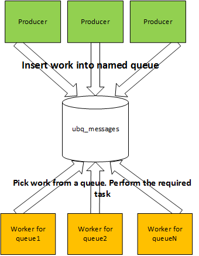

As described in an [Architecture](/docs/architecture.html), when UnityBase is running in the HTTP server mode, it picks up the pool of independent working thread
responsible for processing the HTTP requests - let's call it the HTTP workers.
The number of HTTP workers is configured in the [Sever configuration](/models/UB/docson/index.html#../schemas/ubConfig.schema.json) `httpServer.threadPoolSize` parameter.

Overall scheme is:
    Client sends the HTTP request -> Server puts it to HTTP worker queue -> picks a free HTTP worker -> executes the logic,
 associated with endpoint -> puts a response to a HTTP queue for sending

The endpoint logic is executed in synchronous mode, so client will wait while response is calculated. In most case this is a behavior that the user expects.
For example, the user said "give me a list of my tasks".
The user will not be able to give the next command to the server until the tasks are not rendered on the screen, so he has to wait.

But what to do if we know that operation takes a long period of time? For example the user (or other server) said "create me a big report".
In this case a good decision is to respond to the caller immediately "Yes, we accept your query. Come later and ask for the result",
or "Yes, we accept your query. We will notify you when it will be done".
In both case we need to write a response immediately and "delay" an actual operation.
Since the request has not been completed, the right HTTP response code for such responses [202 "Accepted"].

For the delayed operation UnityBase provides:

   - asynchronous endpoints
   - {@link worker} as an internal mechanism for run scripts in separate thread
   - UBQ model for a message queue
   - {@tutorial schedulers} for a periodical scheduled operations

For the notification about operation results:

  - WebSocket based [Notification subsystem]
  - {@link module:UBMail UBMail module} for sending e-mail notifications
  - {@link module:http http module} for call back an external HTTP services

## Asynchronous endpoints
Any UnityBase endpoint can work in asynchronous mode. If Client sends a request with URL parameter `async=true`
server will immediately answer [202 "Accepted"] to the client and continue handling of the request in one of the HTTP workers.

Of course, the answer received from the endpoint will not be sent to the client, because we already sent the 202 answer.
So this is a responsibility of endpoint handler to store the answer in the right place, for example schedule
a message to client using [Notification subsystem].

The good use case for the asynchronous endpoints is {@tutorial scheduler}. When scheduler worker decides it is a time to execute
a scheduled job, it sends a request to the server in async mode:

    POST /rest/ubq_messages/executeSchedulerTask?async=true

passing a task to be executed in the request body. Server determines the `async=true` URL parameter, and immediately
answers [202 "Accepted"] to the scheduler worker, so worker is not waiting until job is completed and can send
a next job execution request.

{@link TubEntity#addMethod Entity-level method} `ubq_messages.executeSchedulerTask` executes a scheduler job
and since it knows it can receive only async request, writes a result to `ubq_runstst` entity instead of sending it
to the caller.

## UnityBase Queue (UBQ) model
It is common for applications to have workloads that can be processed asynchronously from application flows.
A common example of this is sending an email. For instance, when a new user registers, you may need to send him
a confirmation email to validate that the address the user just entered is actually their.
This involves composing the message from a template; making a request to an email provider; parsing the result;
handling any eventual errors that may occur; retrying, etc.. This flow may be too complicated, error-prone or take
too long to include it in the cycle of an HTTP server. But there is an alternative: instead, we may just insert
a document into persistent storage where we describe that there is a pending message to be sent to this particular user.
Another process may then pick it up and do the heavy lifting: templating, contacting the server, parsing the errors,
and rescheduling the work if necessary.

More generally, it's a common pattern throughout systems to have a work queue that separates the work producers from
the work consumers. The producers insert work into a work queue and the consumers pop work from the queue,
performing the required tasks.

UnityBase provides a UBQ model - a set of entities & components for management of asynchronous task execution.
A producer (either UB HTTP worker or external system) can put (insert) a work into the queue using `ubq_messages.addqueue`
method. Each queue has his own code `ubq_messages.queueCode` and a date when the work is completed `ubq_messages.completeDate`.
Consumers periodically select uncompleted works with a `queueCode` they know from a queue,  perform the required tasks
and mark a task completed using `ubq_messages.success` method.

Consumer can be an external system or an internal server process.
In case consumer is internal process we need to say to the server periodically - "Hey, wake up and handle the works from a
queue with name "Queue1". This is done by using a {@tutorial schedulers}.

So, QUB Model allows to:

 - put a task to persistent queue using `ubq_messages` entity and handle it using {@tutorial schedulers}
 - schedule a delayed job. See {@tutorial schedulers}
 - obtain a statistics about scheduler execution using `ubq_runstat` entity
 - view the jobs timetable using virtual entity `ubq_scheduler`

There are many reasons and advantages in using such topology, such as:

 - Decoupling work producers and work consumers
 - Making retry logic easier to implement
 - Distributing work load throughout time
 - Distributing work load throughout space (nodes)
 - Making asynchronous work
 - Making external systems easier to integrate (eventual consistency)

[202 "Accepted"]: https://httpstatuses.com/202
[Notification subsystem]: /api/server/#!/guide/message