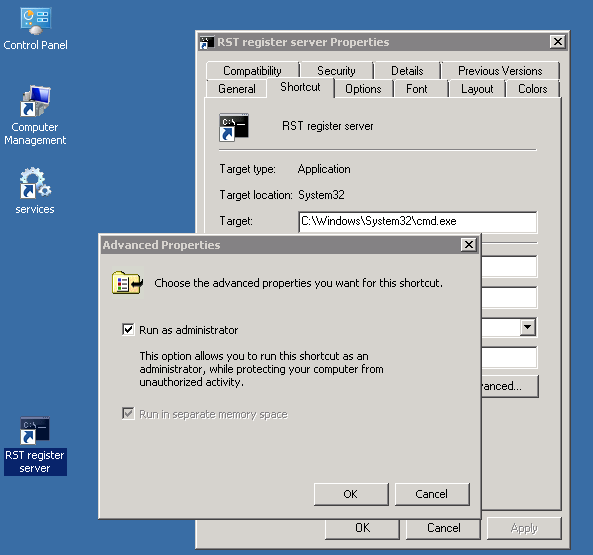
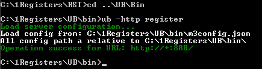

Since `Windows XP SP2` and `Windows Server 2003`, the Operating System provides a kernel stack to handle HTTP requests.
This `http.sys` driver is in fact a full featured HTTP server, running in kernel mode.
It is part of the networking subsystem of the Windows operating system, as a core component.
UnityBase implement a thow kind of HTTP server:

 - based on `http.sys`
 - based on plain sockets

What’s good about http.sys?

*   Kernel-mode request queuing: Requests cause less overhead in context switching, because the kernel forwards
requests directly to the correct worker process. If no worker process is available to accept a request, the kernel-mode
request queue holds the request until a worker process picks it up.
*   Enhanced stability: When a worker process fails, service is not interrupted; the failure is undetectable by the
user because the kernel queues the requests while the WWW service starts a new worker process for that application pool.
*   Faster process: Requests are processed faster because they are routed directly from the kernel to the
appropriate user-mode worker process instead of being routed between two user-mode processes, i.e. the good old
WinSock library and the worker process;
*   Embedded SSL process, when secure HTTPS communication is needed. 

Inside `http.sys` all the magic is made... it will listen to any incoming connection request, then handle the headers,
then check against any matching URL and
handle all the communication by itself, leaving the server threads free to process the next request.
We use a special feature of http.sys to serve a file content as fast as possible.
In fact, UnityBase just sad to `http.sys` to transfer file
and whole file access and sending will occur in background, at the kernel level, so with best performance.

## URI authorization as Administrator

 Standard security policy, as requested by Windows for all its http.sys based systems (i.e. IIS and WCF services)
 is to explicitly register the URI. Depending on the system it runs on (i.e. Windows XP or Vista and up),
 a diverse command line tool is to be used.

 For `Vista` and UP you can use

    >netsh http

command line tool to manipulate URI registration. For example to to see currently registered URLs type command:

    >netsh http show urlacl

There is also GUI tools for manipulating http.sys URL ACL: [HttpSysConfig.exe](guides/HTTPServer/HttpSysConfig.exe) (click to download)

To keep it simple, UnityBase provides a dedicated command line options to requester a particular URI prefix depending
on current server configuration.

    >ub -http register|unregister

command will add / remove UnityBase server URI to `http.sys` routing table using current server configuration parameters.

You must run this command under `cmd.exe` that ran with checked "Run as administrator" option.
Create on your Desktop a new shortcut, type cmd.exe in Targer field, click to Advanced button and check "Run as administrator":

Run shortcut, `cd` to UB folder and execute

    >ub -http register

## Tuning a HTTP.sys

 By default HTTP.SYS is tund for a madium-size applications. If you need to support more (>10000) concurrent connection
 you must chage some of default setting.
 In [httpServer config](../models/UB/docson/index.html#../schemas/ubConfig.schema.json) you can cahnge:

     - requestQueueLength
     - maxBandwidth
     - maxConnections
     - timeouts

 Other low-level settings can be changed in the registry (requre Winodws reboot) -
see a [full list here](https://support.microsoft.com/en-us/kb/820129)

## HTTPS - secure HTTP with TLS

 The http.sys kernel mode server can be defined to serve HTTPS secure content, i.e. the SSL protocol over HTTP.
When the `httpServer.protocol` parameter is set to "https" in server config, the SSL layer will be enabled within http.sys.
Note that "Socket" kind of server does not offer SSL encryption yet.

In order to let the SSL layer work as expected, you need first to create and import a set of certificates.
Here are the needed steps, as detailed in [this article](http://www.codeproject.com/Articles/24027/SSL-with-Self-hosted-WCF-Service) or
[MSDN article](http://msdn.microsoft.com/en-us/library/ms733791.aspx)

 By default only SSL 2.0 are enabled in Windows. This protocol is not secure enought in modern world, so
**we recommend to disable SSL 2.0 and enable TLS 1.2 instead**.
See [TLS/SSL Settings article](https://technet.microsoft.com/en-us/library/dn786418.aspx#BKMK_SchannelTR_TLS12) for details.

### Certificates

You need one certificate (cert) to act as your root authority, and one to act as the actual certificate to be used for the SSL,
which needs to be signed by your root authority.
If you don't set up the root authority your single certificate won't be trusted, and you will start to discover this through
a series of extremely annoying exceptions, long after the fact.

The following command (run in a Visual Studio command prompt) will create your root certificate:

    >makecert -sv SignRoot.pvk -cy authority -r signroot.cer ^
      -a sha1 -n "CN=Dev Certification Authority" ^
      -ss my -sr localmachine

Take a look at the above links to see what each of these arguments mean, it isn't terribly important, but it's nice to know.
The MakeCert tool is available as part of the Windows SDK, which you [can download here](http://go.microsoft.com/fwlink/p/?linkid=84091).
If you do not want to download the whole Visual Studio package. Membership in Administrators, or equivalent, on the local computer is the
minimum required to complete this procedure.

Once this command has been run and succeeded, you need to make this certificate a trusted authority.
You do this by using the MMC snap in console.
Go to the run window and type `mmc`, hit enter. Then in the window that opens (called the "Microsoft Management Console", for those who care)
perform the following actions:

    File -> Add/Remove Snap-in -> Add… -> Double click Certificates
    -> Select Computer Account and Click Next -> Finish -> Close -> OK

Then select the Certificates (Local Computer) -> Personal -> Certificates node

You should see a certificate called "Dev Certificate Authority" (or whatever else you decided to call it as parameter in the above command line).
Move this certificate from the current node to

    Certificates (Local Computer) -> Trusted Root Certification Authorities
    -> Certificates node

drag and drop works happily.

Now you have NOT the cert you need :) You have made yourself able to create trusted certs though, which is nice.
Now you have to create another cert, which you are actually going to use. Run makecert again, but run it as follows...

    >makecert -iv SignRoot.pvk -ic signroot.cer ^
      -cy end -pe -n CN="localhost" -eku 1.3.6.1.5.5.7.3.1 ^
      -ss my -sr localmachine -sky exchange ^
      -sp "Microsoft RSA SChannel Cryptographic Provider" -sy 12

Note that you are using the first certificate as the author for this latest one.
This is important... where I have localhost you need to put the DNS name of your box. In other words, if you deploy
your service such that its endpoint reads __http://bob:10010/Service__ then the name needs to be bob. In addition, you are going to need to
do this for each host you need to run as (yes, so one for bob and another one for localhost).

Get the signature of your cert by double clicking on the cert (Select the Certificates (Local Computer) ' Personal ' Certificates),
opening the details tab, and scrolling down to the "Thumbprint" option.

Select the thumbprint and copy it. Put it in Notepad or any other text editor and replace the spaces with nothing.
Keep this thumbprint heaxdecimal value safe, since we will need it soon.

You have your certs set up. Congrats! But we are not finished yet.

### Configure a Port with an SSL certificate

Now you get to use another fun tool, `httpcfg` (for XP/2003), or its newer version, named aka `netsh http` (for Vista/Seven/Eight).

Firstly run the command below to check that you don't have anything running on a port you want

 under XP

    >httpcfg query ssl

 under Vista/Seven/Eight

    >netsh http show sslcert

If this is your first time doing this, it should just return a newline.
If there is already SSL set up on the exact IP you want to use (or if later on you need to delete any mistakes) you can use the following command,
where the IP and the port are displayed as a result from the previous query.

Now we have to bind an SSL certificate to a port number, as such
(here below, `0000000000003ed9cd0c315bbb6dc1c08da5e6` is the thumbprint of the certificate, as you copied it into
the notepad in the previous paragraph):

 under XP

    > httpcfg set ssl -i 0.0.0.0:8012 -h 0000000000003ed9cd0c315bbb6dc1c08da5e6

 under Vista/Seven/Eight

    >netsh http add sslcert ipport=0.0.0.0:8000 ^
      certhash=0000000000003ed9cd0c315bbb6dc1c08da5e6 ^
      appid={00112233-4455-6677-8899-AABBCCDDEEFF}

Here the `appid=` parameter is a GUID that can be used to identify the owning application.

To delete an SSL certificate from a port number previously registered, you can use one of the following commands:

 under XP

    > httpcfg delete ssl -i 0.0.0.0:8005 -h 0000000000003ed9cd0c315bbb6dc1c08da5e6
        httpcfg delete ssl -i 0.0.0.0:8005

 under Vista/Seven/Eight

    > netsh http delete sslcert ipport=0.0.0.0:8005

Note that this is mandatory to first delete an existing certificate for a given port before replacing it with a new one.