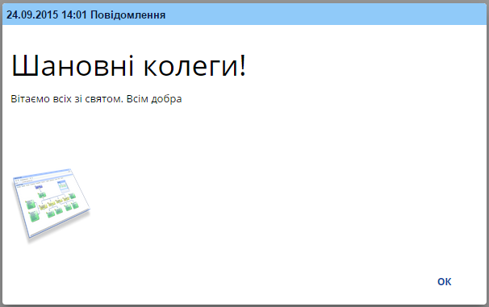
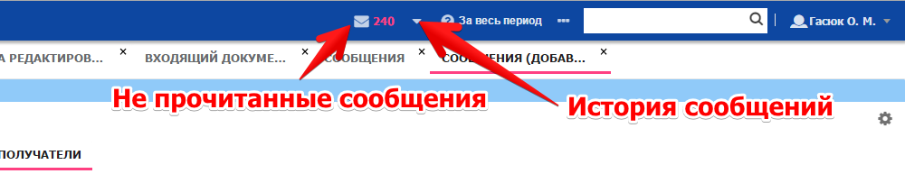

# Настройка и использование системы уведомлений

  **WARNING** Starting from UB 1.11 notification updates is sending by ubNotifier WebSocket protocol.
  To receive notifications on the `adminUI`:

   - UnityBase server must be installed on Win8(WinServer 2013) & UP.
   - WebSocket must be enabled in server config see {@guide WebSockets}

## Общая информация
Предназначена для гарантированной доставки сообщений пользователям с подтверждением прочтения.
Сообщения могут содержать как текстовую информацию так и HTML.
На клиенте наличие сообщений проверяется при каждой авторизации и при получении нотификации `ubs_message` по WebSocket протоколу.

## Включение и настройка подсистемы для сервиса
В конфигурационном файле UB:
Подключить модель UBS.

      	"domainConfigs": {
		"AppName": {
			"models": {
				"UBS": 		{ "path": "UB\\models\\UBS" }
			 }
            	 }
        }       

Если модель подключают к существующему приложению выполнить ее инициализацию:

      >ub cmd/initialize -m UBS

В секцию конфига `application.uiSettings.adminUI` добавить `messenger.enabled: true`:

        "uiSettings": {
            "adminUI": {
                ...
                "messenger": {
                    "enabled": true
                }
                ...
            },
            ...
        },

Подключить на верхнюю панель виджет `UBS.MessageBar`:

      $App.on('buildMainMenu', function (items) {
          items.push(
              Ext.create('UBS.MessageBar'),
          );
      });
 
Создать ярлык для реестра сообщений (создается автоматом при инициализации модели `UBS`):

       {"cmdType": "showList",
        "cmdData":{ 
            "params":[{ 
                "entity": "ubs_message_edit", 
                 "method": "select", 
                 "fieldList": ["messageBody", "messageType", "complete", "startDate", "expireDate"]         
            }]
        }
       }

Добавить шедулер для периодической проверки наличия сообщений к отправке и рассылки нотификаций.
Поправить файл `schedulers\schedulers.json` в корне приложения, добавив блок (для примера - раз в 10 минут):

        "ubs_messages": {
            "enabled": true,
            "ownerUser": "admin",
            "runcmd": "ubs_message_edit.notifyAllRecipients",
            "useDaysOf": "Month",
            "daysOfMonth": [],
            "allMonthDays": true,
            "lastMonthDay": true,
            "daysOfWeek": [],
            "timePeriodic": "Periodic",
            "timeList": [],
            "timePeriodicHour": 0,
            "timePeriodicMinute": 10,
            "name": "ubs_messages"
        }

При этом если создавать сообщения, указывая в качестве "Действително с" текущую дату-время, нотификации на такие сообщения
уйдут мгновенно (отработает обработчик `ubs_message_edit.on('update:after')`).

## Настройка прав доступа

Для пользователя редактирующего сообщения - `ubs_message_edit.*`

Для всех пользователей получающих сообщения - `ubs_message.select, ubs_message.getCached, ubs_message_recipient.accept`

В стандартной поставке права на получения даны роли `Everyone`, на редакторование - только роли `admins`.

## Создание сообщений
Открыть реестр сообщений. Создать новое сообщение. Выбрать тип сообщения:

 - Информация 
 - Пользователь 
 - Предупреждение
 - Система 

Все типы выводят сообщение сразу же после получения в виде модального окна, 
кроме "Информация" - для просмотра такого рода сообщений необходимо кликнуть на вайджите.
Так же типы сообщений отличаются текстом в заголовке. Больше отдличий между ними нету.

Поле `действительно с` - пользователь не получит сообщение ранее этой даты.
Поле `действительно по` -  пользователь получит сообщение даже если `дата по` меньше текущей даты пользователя. 
Будет использоваться для сравнения даты прочтения с этой датой.

Перейти на закладку "сообщение" и ввести сообщение. В сообщение можно вставить картинку.
Лучше использовать загрузку картинки из файла, чем вставку ссылки. Ссылка может быть не доступна пользователям.

В блоке "получатели" указать получателей. Для удобства, в верхней части есть интерфейс, через который можно добавить или удалить пользователей выбраной роли.

Столбик "Дата подтверждения" будет заполнен после подтверждения пользователем прочтения сообщения.

Установить галку "Готово к отправке", если вы хотите чтобы сообщение сразу пошло в работу.
Если эту галку снять, то все адресаты не получившие сообщение уже не получат сообщение. 

Форма позволяет редактировать сообщение даже после отправки но адресаты, которые получили сообщение, ваших изменений уже не увидят.

## Просмотр сообщений

При получении сообщения с типом "Информация" увеличивается счетчик не прочитанных сообщений в виджете.

При получении любого другого сообщение оно сразу выводится. По нажатию кнопки "ОК" сообщение считается прочитанным.

Также сообщения можно просмотреть в реестре истории сообщений.
