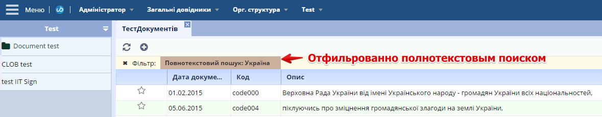

# Работа с полнотекстовып поиском (FTS)

## Общая информация
  В платформу UnityBase встроен сервис полнотекстового поиска на базе [расширения SQLite FTS4](http://sqlite.org/fts3.html),
с поддержкой Украинской, Русской и Английской морфологий.

  Сервис может быть использован как в "ручном" (програмист самостоятельно должен написать CRUID операции
для обновления полнотекстового индекса при изменении данных сущности),
так и в "автоматическом" режиме - в этом случае для сущностей, которые необходимо индексировать полнотекстовым поиском необходимо
подключить и сконфигурировать миксин `fts.

  При работе через миксин обновление полнотекстового индекса производится "на лету", то есть сразу же после обновления данных
сущности (после коммита транзакций), либо в "асинхронном" режиме (`application.fts.async=true` в конфиге приложения).

  Существует возможность как использовать общий индекс для нескольких сущностей, так и разнести разнести сущности по разным
БД полнотекстового поиска (указанием разных `mixins.fts.connectionName` в метафайлах сущности).

  Поддерживается поиск с ограничениями по ДАТЕ, и по спискам контроля доступа (mixin `aclRLS`).

## Включение FTS для приложения

 **Ниже приведены примеры для приложения `autotest`**

 Включаем FTS на уровне приложения, добавив в конфиг (`ubConfig.json`) опцию `fts.enabled: true`:

        	"application": {
                    ......
                    "fts": {
                        "enabled": true
                    },
       		}

 Добавляем коннекшин для SQLite БД полнотекстового поиска. Имя соединения по умолчанию `ftsDefault`:

        "application": {
               ......
               "fts": {
                   "enabled": true,
               },
               .....
               "connections": [{
                   	"name": "ftsDefault", 
                       	"driver": "SQLite3",
                      	"dialect": "SQLite3",
                      	"databaseName": "./fts/autotestFTS.ftsdb",
                       	"supportLang": ["uk"],
                       	"advSettings": "Synchronous=Off,Tokenizer=stemka,TokenizerParams=\"stem=yes\""
                    },
                   ......
               ]
     	}

 При необходимости можно определить несколько полнотекстовых БД(конекшинов), при этом в описании миксинов сущности необходимо указывать имена соответствующих соединений.

 Пример добавление второго конекшена:
 
		"application": {
                ......
                "fts": {
                    "enabled": true,
                },
                .....
                "connections": [{
                    "name": "ftsDefault",
                    "driver": "SQLite3",
                    "dialect": "SQLite3",
                    "databaseName": "./fts/autotestFTS.ftsdb",
                    "supportLang": ["uk"],
                    "advSettings": "Synchronous=Off,Tokenizer=stemka,TokenizerParams=\"stem=yes\""
                }, {
                    "name": "ftsSubjectSearch",
                    "driver": "SQLite3",
                    "dialect": "SQLite3",
                    "databaseName": "./fts/autotestFTSSubjectSearch.ftsdb",
                    "supportLang": ["uk"],
                    "advSettings": "Synchronous=Off,Tokenizer=stemka,TokenizerParams=\"stem=yes\""
                },
                .....
                ]
        }

 В миксине сущности соответствующее соединение второго конекшена наглядно указываем через `"connectionName": "ftsSubjectSearch"`
 
 **Важно: **

 - БД полнотекста должны располагаться на **локальной** к серверу приложений файловой системе (желательно SSD)
 - Рекомендуется называть файл БД начиная с имени приложения
 - обязательно необходимо задать список поддерживаемых языков
 - директория, в которой находится БД должна существовать. На этапе добавления FTS БД должна отсутствовать
 - SQLIte база переключена в режим WAL. BusyTimeout=10sec. Не делайте длинных транзакций!!
 - параметр "advSettings": "Synchronous=Off" в 20 раз ускоряет изменения в полнотекстовый индекс, но при этом ваш сервер длолжен быть защищен от перепадов питания
  
## Использование и настройка токенайзера в полнотекстовом поиске
Токеназер - это программа, которая разбивает строки на лексемы.

Платформа UnityBase поддерживает токенайзер "stemka", который может не только корректно разбить строки на русские и украинские лексемы,
но также содержит в себе вероятностный морфологический анализатор русского и украинского языков.

Для указания этого токенайзера существует параметр с именем "Tokenizer" в "advSettings". Если значение "stemka" не указать, 
то используется токенайзер "simple" из стандартной поставки SQLite.
Токенайзер "stemka" может принимать на вход несколько аргументов, которые прописываются в параметре "TokenizerParams":

- "stem=yes|no" - Включает/отключает морфологический анализатор русского и украинского языков. По умолчанию значение "yes".
- "lang=uk|ru" - Язык морфологического анализатора. По умолчанию значение "uk", но значение этого параметра контролируется 
платформой UnityBase при создании FTS-таблицы сущности и на данный момент не рекомендуется использование 
этого параметра в "TokenizerParams".

 **Важно: **
После смены значения параметра "Tokenizer" или "TokenizerParams" нужно ОБЯЗАТЕЛЬНО пересоздать и потом переиндексировать 
SQLite БД полнотекстового поиска, т.к. токенайзер и его аргументы прописаны в заголовке каждой FTS-таблицы. 
То есть, БД полнотекстового поиска будет работать, но использовать токенайзер и аргументы, которые были на момент создания этой БД.

  
## Добавление сущностей в полнотекстовый поиск

Для добавления сущности в полнотекстовый поиск необходимо в meta файле сущности сконфигурировать миксин fts.
`myEntity.meta`:

        "mixins": {
            ....
            "fts": {
                "dataProvider": "Mixin",
                "scope": "Connection",
                "indexedAttributes": ["code", "description"],
                "dateAttribute": "docDate"
            }

В примере выше мы для сущности `myEntity`:

 - использовали соединение `ftsDefault` (по умолчанию, поскольку упущен параметр 'connectionName') для хранения полнотекстового индекса
 - указали необходимость индексировать два атрибута: `code` и `description`
 - дополнительно в индекс добавили хеш атрибута `docDate`, благодаря чему можно выполнять полнотекстовый поиск с учётом ограничения по датам

Теперь при любых CRUD операциях с сущностью `myEntity` полнотекстовый индекс будет обновляться синхронно.

## Начальное построение полнотекстового индекса / переиндексация

В штатном режиме работы, когда добавление/удаление/модификация данных сущности производится через методы сущности insert/delete/update 
перестроение полнотекстового индекса производится автоматически.

Тем не мение бывают ситуации, когда требуется перестроить/построить полнотекстовый индекс заново. Например: 

 - миксин fts добавляется к сущности, у которой уже есть данные
 - fts был временно отключен на уровне сервера приложений
 - база с полнотекстовым индексом потеряна

В таком случае необходимо воспользоваться утилитой командной строки `cmd/ftsReindex`.
Пример перестройки всего индекса приложения для `autotest`:

	ub cmd/ftsReindex -c ftsDefault -u admin -p admin -host http://127.0.0.1:888/autotest
	
или так (с указаниме файла конфигурации):

	ub cmd/ftsReindex -c ftsDefault -u admin -p admin -cfg ubConfig.json

Детальнее см. справку по команде:
	
	ub cmd/ftsReindex -help

## Настройка асинхронной реиндексации
 Обновление (update) одной записи в полнотекстовом индексе - очень быстрая операция (порядка микросекунд). 
В связи с этим полнотекстовая БД не поддерживает длинных транзакций. В текущей реализации максимальное время транзакции составляет 10 секунд.

 Если бизнес логика приложения работает долго, например после обновления документа (соответственно - запустилась транзакция в полнотекстовой БД) 
выполняются ещё какие-то длительные вычисления, а в это тмомент другой пользователь тоже затребует модификацию индекса 
- получим ошибку `SQLITE_BUSY (5) - "database is locked"`.
 
 Выход из ситуации - настройка fts для запуска в асинхронном режиме. В таком режиме при изменении сущностей с миксином fts не производится 
моментальное обновление полнотекстового индекса, но в очередь сообщений `ubq_messages` записывается команда на обновление индекса по модифицированному екземпляру.
     
 Непосредственно обновление индекса выполняетсчя планировщиком заданий путём переодического запуска зхадачи `UB.UBQ.FTSReindexFromQueue`. 
            
### Включаем асинхронное обновление полнотекста

На уровне приложения, в конфиг (`ubConfig.json`) добавляем опцию `fts.async: true`:

        "application": {
                    ......
                    "fts": {
                        "enabled": true,
                        "async": true
                    },
                    .....
                    "connections": {
                        ......
                    }
        }

В перечне моделей `domainConfigs` дожна быть добавлена модель **UBQ**

### Настраиваем планировщик
Добавляем новую задачу в планировщик для переодического обновление индекса, например раз в 10 минут 
в конфигарационный файл планировщика `\Autotest\schedulers\schedulers.json`:
 
        {
            ....,
            "fts":{
                 "enabled": true,
                 "ownerUser": "admin",
                 "runcmd": "UB.UBQ.FTSReindexFromQueue",
                 "useDaysOf": "Month",
                 "daysOfMonth": [],
                 "allMonthDays": true,
                 "lastMonthDay": true,
                 "daysOfWeek": [],
                 "timePeriodic": "Periodic",
                 "timeList": [],
                 "timePeriodicHour": 0,
                 "timePeriodicMinute": 10,
                 "name": "fts"
            }
        }
        
Включаем планировщик на уровне приложения:
 
        "enabledSchedulers": true,
    	
    	
## Програмное использование полнотекстового поиска
 
### Поиск по конкретной сущности
Поиск по конкретной сущности - используем условие `match` в `where`:

    UB.Repository('myEntity').attrs(["ID", "code"])
        .where('', 'match', 'республіка')
        .selectAsObject()
        .done(UB.logDebug);

С добавлением условий на другие атрибуті сущности (в нанном примере - docDate):

    UB.Repository('tst_document').attrs("ID")
        .where('', 'match', 'Україна')
        .where('docDate', '<', new Date(2015, 02, 13))
        .selectAsArray()
        .done(UB.logDebug);

Оба примера выше выполняются в 2 этапа:

    - поиск по полнотекстовому индексу идентификаторов записей, удовлетворяющих условию `match`
    - выбор из сущности записей по найденным идентификаторам с наложением дополнительных условий (если присутствуют)

Несомненный плюс такого подхода - возможность выбрать любой набор атрибутов сущности,
а не только те атрибуты, которые включены в полнотекстовый индекс, а так же - построенние
финальной выборки с учетом огранчений, накладіваеміх на сущносить другими миксинами, например RLS.

Минус - усложнение запросов (большое к-во елементов в условии IN), когда результатом полнотекствого поиска является много записей.

### Поиск по всем сущностям одного индекса
При подключении fts в сущностях, и указании атрибутов для индексирования, создается таблица в файле полнотекстового поиска, которая содержит индексируемые данные

Поиск по всем сущностям в данном конекшине - используем метод `fts_ftsDefault.fts`:

    $App.connection.run({
        entity: "fts_ftsDefault",
        method: "fts",
        fieldList: ["ID", "entity", "entitydescr", "snippet"],
        whereList: {match: {condition: "match", values: {"any": "Україна"}}},
        options: {limit: 100, start: 0}
    })
    .done(function(result){...});

Но также можно указывать конкретную сущность `tst_incDocument`, используя метод `fts`

## UI контролы полнотекстового поиска

### Комбобокс с поддержкой полнотекстового поиска

### Виджет для верхнего тулбара
Виджет полнотекстового поиска UB.view.FullTextSearchWidget для верхнего тулбара позволяет пользователю искать
по всем сущностям выбранного коннекшина.
На програмном уровне делает запрос, аналогичный описанному в "Посиск по всем сущностям одного индекса"

Добвить виджет на тулбар можно в клиентском коде инициализации Вашей модели (`YourModel/public/initModel.js`)
следующим образом:

    $App.on('buildMainMenu', function(items){
      items.push(
          Ext.create('UB.view.FullTextSearchWidget')
      );
      return false;
    });

В результате получим следующий функционал

Двойной клик на строчке грида с результатами поиска откроет форму по умолчанию соответствующей сущности.

См. [документацию и примеры использования](https://unitybase.info/api/adminUI/#!/api/UB.view.FullTextSearchWidget)

### Создание своего поиска на форме
Пример создания своего поля поиска с использованием `fts` по аналогии с виджетом `UB.view.FullTextSearchWidget`:
 - Создаем строку для ввода данных:
	
	var me = this;
	me.textBox = Ext.create('Ext.form.field.Text', {
            enableKeyEvents: true,
            fieldLabel: UB.i18n('myFieldLabel'),            
            style: "color: black; border-width: 5px;",
            fieldStyle: "border-width: 0px;",
            listeners: {
                keyup: function(sender, e){
                    if (e.getKey() === e.ENTER){
                        me.buttonClick();
                    }
                },
                scope: me
            }
        });
 
 - Если необходимо, создаем кнопку-иконку поиска:
 
        me.button = Ext.create('Ext.button.Button',{
                border: false,
                margin: 3,
                padding: 1,
                style: {backgroundColor: 'white'},
                glyph: UB.core.UBUtil.glyphs.faSearch,
                handler: me.buttonClick,
                scope: me
            });
		
 -  Добавляем в нужное место на форме:
 
        {
           xtype: 'panel',
           layout: 'hbox',
           style: {
               background: "white"
           },
           items: [
               me.textBox,
               me.button
           ]
        }
 
 - Используем поиск по всем сущностям или конкретно указанной (см. `Поиск по всем сущностям одного индекса`)
	
        buttonClick: function() {
            ...
            $App.connection.run({
                entity: "fts_ftsDefault",
                method: "fts",
                fieldList: ["ID", "entity", "entitydescr", "snippet"],
                whereList: {match: {condition: "match", values: {"any": "Україна"}}},
                options: {limit: 100, start: 0}
            })
            .done(function(result){...});
            ...
        }
	
### Предварительная фильтрация справочника (автофильтр)
При передачи на уровне команды `showList` параметра `autoFilter`
(пример ярлыка):

    {
    	"cmdType": "showList",
        "autoFilter": true,
        "cmdData": {
    		"params": [{
                "entity": "tst_document",
                "method": "select",
                "fieldList": ["favorites.code", "docDate", "code", "description", "fileStoreSimple"]
            }]
    	}
    }

для сущностей с миксином `fts` добавляется отдельная вкладка "Полнотекстовый поиск":

Для гридов, отфильтрованным полнотекстовым поиском - соответствующая индикация:

На програмном уровне формируется запрос, аналогичный описанному в "Поиск по конкретной сущности".

См. дополнительно [документацию по конфигурированию автофильтра](https://unitybase.info/api/adminUI/#!/api/UB.ux.UBPreFilter)

## Правила построения запросов 

### Cлужебные символы, которые принимают участие в построении запроса

| Служебные символы|
|-----------------|
| * |
| # |
| ( |
| ) |
| [ |
| ] |

### Символы разделители, поиск по которым не будет производится

Символы из таблицы ниже являются незначащими для полнотекстового индекса (грубо говоря - это все равно что пробел)

| Символы разделители|
| ----------------- |
| - |
| , |
| . |
| / |
| \ |
| : |
| { |
| } |
| = |
| + |
| & |
| ^ |
| % |
| $ |
| @ |
| # |
| ! |
| ? |
| ~ |
| ` |
| ' |
| ; |

