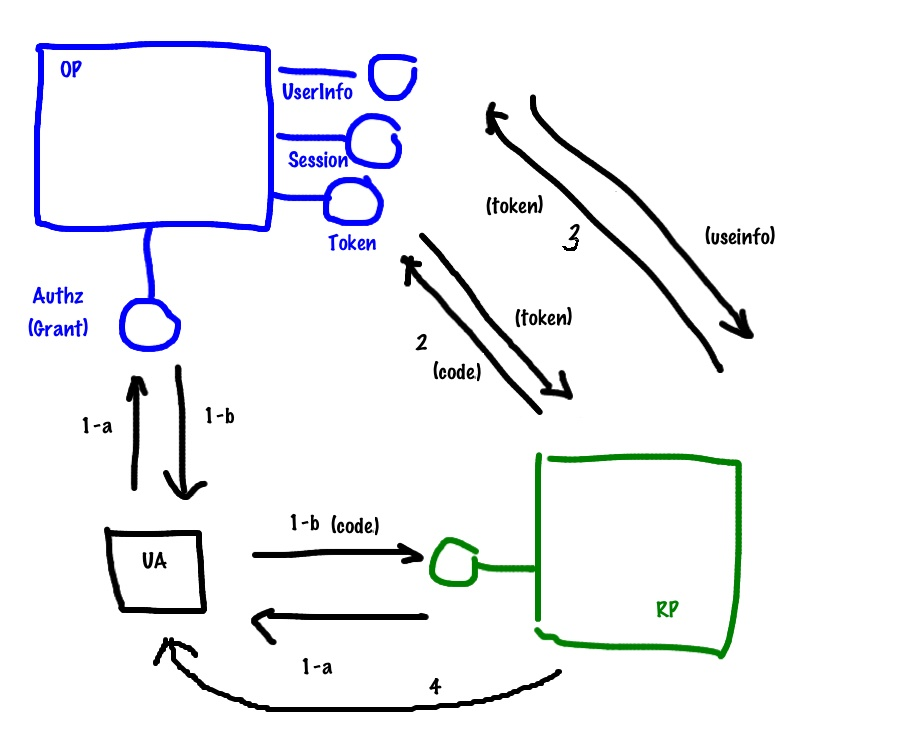

# Аутентификация на сервере UB с помощью OpenID Connect

В версии 1.11 добавлен механизм аутентификации с ипользованием третьей  удостоверяющей стороны
по протоколу [OpenID Connect](https://en.wikipedia.org/wiki/OpenID_Connect).

В данной схеме аутентификация (проверка имени пользователя и пароля) производится
**провайдером OpenID Connect** (например, Google), а последующая авторизация - с использованием
[протокола авторизации UB](https://dev.softengi.com/confluence/display/UB/Authentication+in+1.8)

## Регистрация на стороне провайдере OpenID Connect
В соответствии с руководством вашего OpenID Connect провайдера необходимо зарегистрировать приложение.
Для регистрации в Google инструкция [по этой ссылке](https://developers.google.com/identity/protocols/OpenIDConnect)

При регистрации необходимо сообщить провайдеру адрес на который с него позволено редиректиться (не для всех провайдеров),
и получить:

 - url авторизации (**authUrl**)
 - url получения токена (**tokenUrl**)
 - url получения информации о пользователе (**userInfoUrl**)
 - id нашего приложения (**client_id**)
 - secret нашего приложения (**client_secret**)
 
## Настройка сервера UB

### Изменения в конфигурационном файле
Для использование в AdminUI в секции authMethods добавляем значение "OpenIDConnect"

    ...
    "authMethods": [...,"OpenIDConnect"...],
    ...

Для клиентов, которые не используют метаинформацию сервера для постороения окна логина данный шаг не обязателен.

### В модели прикладной области

    // Подключаем модуль 'openIDConnect'
    var openIDConnect = require('openIDConnect');
    // Регистрируем точку доступа
    var openIDConnectEndPoint = openIDConnect.registerEndpoint(<EndPoint name>);

**`<EndPoint name>`** - имя точки доступа. Для AdminUI **нужно** использовать имя "openIDConnect"

    // Регистрируем провайдер
    openIDConnectEndPoint.registerProvider(<Provider name>,{
	    authUrl: <authUrl>,
	    tokenUrl: <tokenUrl>,
	    userInfoUrl: <userInfoUrl>,
	    client_id: <client_id>,
	    client_secret: <client_secret>,
	    userInfoHTTPMethod: <userInfoHTTPMethod>,
	    scope: <scope>,
	    nonce: <nonce>,
	    response_type: <response_type>,
	    getUserID: function(userInfo) {
		    ...
		    return id
		    ...
		    return null
		    ...
	    },
	    onFinish: <onFinish>
    });

Пояснения и пример для авторизации при помощи *Google*:

 - **`<Provider name>`** - имя провайдера. Будет отображаться в списках доступный провайдеров данной точки доступа.
*_Например, 'Google'_*

 - **`<authUrl>`** - url авторизации, полученный от провайдера.
*_Например, 'https://accounts.google.com/o/oauth2/auth'_*

 - **`<tokenUrl>`** - url получения токена, полученный от провайдера.
*_Например, 'https://accounts.google.com/o/oauth2/token'_*

 - **`<userInfoUrl>`** - url получения информации о пользователе, полученный от провайдера.
*_Например, 'https://www.googleapis.com/oauth2/v1/userinfo'_*

 - **`<client_id>`** - id нашего приложения, полученный от провайдера.
*_Например, '350085411136-lpj0qvr87ce0r0ae0a3imcm25joj2t2o.apps.googleusercontent.com'_* (для зарегистрированного мной тестового приложения)

 - **`<client_secret>`** - secret нашего приложения, полученный от провайдера.
*_Например, 'dF4qmUxhHoBAj-E1R8YZUCqA'_* (для зарегистрированного мной тестового приложения)

 - **`<userInfoHTTPMethod>`** - HTTP метод отправки параметров для получения информации о пользователе.
Зависит от провайдера. Если указан не 'POST', то используется 'GET'(по умолчанию).
*_Например, Google требует чтобы параметры для получения информации о пользователе передавались именно 'GET'_*

 - **`<scope>`** - к каким api провайдера запрашиваем доступ(разделяем при помощи '+').
Обычно достаточно 'openid', но некоторые провайдеры могут требовать больший список.
Или же нам для авторизации пользователя надо получить больше информации.
*_Например, 'openid'_*

 - **`<nonce>`** - nonce, передаваемый провайдеру.
В модуле его значение пока не проверяется. Параметр для модуля необязательный.
Некоторые провайдеры требуют этот параметр как обязательный.
*_Например, '1'_*

 - **`<response_type>`** - типы ответа провайдера(разделяем при помощи '+').
Для модуля важно чтобы среди типов ответа был 'code' - именно его модуль использует.
Некоторые провайдеры могут требовать дополнительные типы ответов.
*_Например, 'code'_*

 - **`<onFinish>`** - метод клиента, который мы вызываем после проверки на право доступа пользователя.
Значение, используемое AdminUI - *'(function (response) { opener.postMessage(response, "*")})'*

 - **getUserID** - функция, на вход которой, передается ответ сервера на запрос информации о  пользователе.
Функция должна проверить имеет ли пользователь с такой информацией доступ к системе,
возможно, создать нового пользователя, назначить ему права,
и вернуть его id из сущности _uba_user_.
Если пользователь не имеет права на доступ к приложению функция должна вернуть `null`. **Пример функции:**

		getUserID: function(userInfo) {
			var inst = UB.Repository('uba_user').attrs(['ID'])
				.where('[name]', '=', userInfo.id).select();
			if (inst.eof)
				return null;
			else
				return inst.get('ID');
		}

## Принцип работы

После добавления точки доступа на сервере [регистрируется](index.html#!/api/TubApp-method-registerEndpoint) метод уровня приложения с именем **`<EndPoint name>`**.

GET запрос **`/<EndPoint name>`** без параметров вернет масив имен зарегистрированный провайдеров для данной точки доступа.

Дальше рекомендуется открыть в новом окне(**window.open**) адрес **`/<EndPoint name>/<Provider name>`**
Сервер переадресует данное окно на форму ввода логина и пароля **провайдера**, то есть на **authUrl** (1-a).

Пользователь аутентифицируется, после чего провайдер переправляет его на адрес **`/<EndPoint name>/<Provider name>?code=...scope=...`** (1-b).

Сервер UB обращается к провайдеру, и выполняет обмен **'code'** на **'acces_token'**(2),
при помощи которого запрашивает информацию о пользователе у провайдера(3).
Полученная информация о пользователе передается функции **getUserID**, указанной при регистрации провайдера на сервере UB.

Задача ф-ии **getUserID** по полученной от провайдера информации о пользователе вернуть иденитификатор пользователя
из сущности _uba_user_, либо `null` если польщователю вход запрещён. На данном этапе возможно автоматическое создание
пользователя.

 - Если ф-я вернула непустое значение, то сервер создает сессию для пользователя и возвращает html-страницу,
которая вызывает метод **`<onFinish>`** с параметрами успешной авторизации и закрывает окно ввода логина/пароля провайдера.
 - Если ф-я вернула пусто, то возвращаемая html-страница вызывает метод **`<onFinish>`** с признаком неуспешной аутентификации
 `{success: false}`

Пример параметров при успешной аутентификации:

    {
	    success: true,
		data: {
		    logonname: "<user login>"
			result: "<session word>"
			uData: "{<uData>}"
			},
		secretWord: "<secretWord>"
	}

На данном этапе если клиент загружен не по протоколу HTTPS, некоторые браузеры могут ругать пользователя.

Реботающий пример для провайдера Google и IdentityServer3 реализован в приложении `Autotest`
(see `Autotest/models/TST/appLevelMethod.js`)

## Использоваие в PortalUI

AdminUI реализует механизм поддержки множества провайдеров и методов аутентификации, динамически отстраивая форму
логина в зависимости от параметров приложения. В портальных решениях все гораздо проще.
Допустим нам известно, что на серверной части зарегистрирован ендпоинт `openIDConnect` и провайдер `IdentityServer`.
Наш портал для приложения autotest будет приблизительно таким:

	<!doctype html>
	<html>
		<head>
			<meta charset="utf-8"/>
			<title>&laquo;UB portal&raquo;</title>

			
		</head>
		<body >
			<h1>User list</h1>
			

			
		</body>
	</html>

Profit!