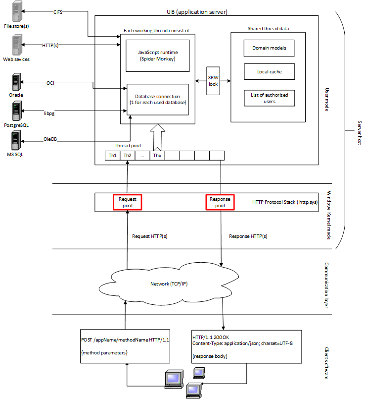

## System layer
 
From the low level point of view UnityBase is a asynchronous non-blocking HTTP(S) server with a:

 - build-in synchronous multi-thread JavaScript engine [SpiderMonkey](https://developer.mozilla.org/en-US/docs/Mozilla/Projects/SpiderMonkey)
 - build-in Database access for a most known RDBMS
 - build-in file systems access

The same UB.exe can act as a command-line JavaScript executor (`ub myscript.js`).
 
## Developer layer

TBD 

 - endpoints
 - entities
 - ORM

## Business layer

TBD

 - ready to use models
 
 

  
