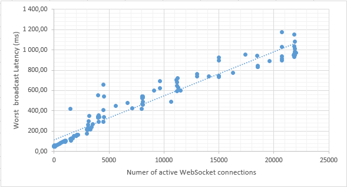

  With help of [WebSockets] developer can implement a two-way Server<->Client communication,
for example sent a notification from server to client when some task are finished on the server-side
or when some data is changed etc.

  [WebSockets] specification itself do not provide neither security nor data format recommendation for such communication,
so in UnityBase we implement a simple JSON messaging protocol and secure it using build-in UnityBase auth mechanisms.

## System requirements & limitations

  You need a *Windows8 & up* or *Windows Server 2012 & up* on the server side.

  All modern browser are support WebSockets on the client side. See [the table](http://caniuse.com/#feat=websockets)

  A single WebSocket connection take a 5Kb of memory. In case you need more when 50000 concurrent connection
several instance of server & load balancing are required.

  On the JsonMessagesProtocol#broadcast operation we discover a linear latency growing during increasing
a number of active connection (the worst case are measured):

  The JsonMessagesProtocol#sendCommand latency is practically independent of the number of connections and
remains within 2-50ms., so our recommendation is to limit a JsonMessagesProtocol#broadcast usage
if you expect more when 10000 concurrent WebSocket connections.
Usage of JsonMessagesProtocol#sendCommand is not a bottleneck.

## Quick example

Set up a `Autotest` application and:

 - see how we initialize server-side protocol in the `Autotest\models\TST\_wsThreadInitialization.js`
 - explore a [pure HTML example](http://localhost:888/autotest/models/TST/wsClient/index.html)
 - see a entity `Autotest\models\TST\tst_maindata.js` for example of sending notification after entity `update`/`insert`

## Server-side
  On the server side [WebSockets] implemented as a dedicated (compiled inside `UB.exe`) service with its own threads pool.

  By default UnityBase start a single thread for WebSocket (wsServer.threadPoolSize === 1), so code inside this
thread must be as fast as possible(like in node.js). Because of this we do not add a database (domain) support to
such threads. In case you need a database operations you must call a HTTP server. We plane to add a *fast* database (`sqlite3`)
support for WebSocket threads in future.

### Enable WebSocket support
  To set up a WebSocket support on the server side you must add a `wsServer` section to the server config (example):

        "httpServer": {...},
        "wsServer": {
            "host": "127.0.0.1",
            "port": "888",
            "path": "ws"
        },....

  Because [WebSockets] is implemented over HTTP(S), you MUST configure a `httpServer` also. In case you expect
many (more when 10000) concurrent connection tuning of HTTP.SYS is required (depend on your usage scenario).
See {@tutorial HTTPServer} for details.

### Add a protocol
  The second step is to add a protocols (`subprotocols` in term of WebSocket RFC) in the WebSocket threads.
UnityBase will call `require('models\yourModel\_wsThreadInitialization.js')` for each domain
model during server startup. Inside this module you initialize a build-in {UB#getWSNotifier wsNotifier} protocol:

        const WebSockets = require('WebSockets');
        const wsNotifier = WebSockets.getWSNotifier();

and assign handlers to it (if you need to receive web socket messages in server):

        if (wsNotifier) {
            console.debug('Start subscribing to wsNotifier tsts_* events');
            wsNotifier.on('tst_echo', function (connection, params) {
                connection.send({
                    command: 'tst_message', params: {from: connection.session.userID, message: params}
                });
            });
        }

or create a your own protocol implementation - see for example how {UB#getWSNotifier UB.getWSNotifier()} is implemented.

### Sending a message
 You can send a message to the WebSocket connection either from WebSocket thread or from HTTP thread.
In case of HTTP thread do not try to obtain a protocol instance during thread initialization -
both HTTP & WebSocket thread pool are initialized in parallel.
So you must obtain a protocol instance inside entity methods:

    const WebSockets = require('@unitybase/ub/modules/web-sockets');
    function SomeMethod(ctx){
        var notifier = WebSockets.getWSNotifier();
        if (notifier) {
            store.currentDataName = 'selectAfterInsert';
            if (!store.eof) {
                rowID = store.get('ID');
            }
            //send message to ALL connected sessions
            notifier.broadcast('ub_entityModification', {action: 'insert', ID: rowID});

            //Send to specific user
            var userSessions = notifier.getUserSessions(Session.userID);
            userSessions.forEach(function(sessionID){
                notifier.sendCommand('test_command', sessionID, {action: 'inserted', ID: rowID});
            });
        }
    }

  **WARNING** To avoid conflicts with other models ALWAYS append a model prefix to your events name

        //WRONG
        notifier.sendCommand('hello', sessionID, {action: 'inserted', ID: rowID});

        //GOOD (trs - is a model code here)
        notifier.sendCommand('trs_hello', sessionID, {action: 'inserted', ID: rowID});

For a full list of available methods see {JsonMessagesProtocol}

## Client side implementation

 `ub-core.js` package contain a client-side helper class UBNotifierWSProtocol. For a `adminUI` instance of this
class is accessible via singleton $App.ubNotifier

  Inside your model you can subscribe to events of $App.ubNotifier:

    if ($App.ubNotifier.supported){
        $App.ubNotifier.on('ubs_message', me.checkMessages.bind(me));
    }

 To check UnityBase server support a spacified WebSocket protocol (i.e WebSocket is supported by the server OS,
configured in the server config and protocol are registered) you must check a `supportedWSProtocols` section
of `getAppInfo` response.

 On the client side HTML5 WebSocket can be used:

    $App.connection.authorize().then(function(session){
        $session = session;
        $ws = new WebSocket('ws://' + location.host + '/autotest/ws?SESSION_SIGNATURE=' + session.signature(), 'ubNotifier');

        $ws.onopen = function(e){
            console.log('Connected to:', e.target.url, 'protocol:', e.target.protocol);
        };

        $ws.onmessage = function(e){
    		var msg;
    		try {
    			msg = JSON.parse(e.data)
    		} catch (err) {
                console.error('Invalid command from server:', e.data);
    		}
            var
                command = msg.command,
                params = msg.params;
            if (command === 'accepted') {
                console.log('Server accept connection with session ID=', params.connectionID);
            } else if (command  === 'tst_message') {
                console.log('New message. ', params.from, 'said:', params.message);
            } else if (command  === 'error') {
                console.error('Error. Details:', params.description);
            } else {
                console.error('Invalid server response. Command', command, 'is unknown');
            }
        };

        $ws.onclose = function(e){
    		console.log('Connection closed from server. Code:', e.code, 'Reason:', e.reason);
        }
    }).done();

Now you can send a messages

    $ws.send(JSON.stringify({command: 'yourCommand', params: {a: 12, b: 2}});

## Application architecture tips
TODO

Написать о том, что

 - вебсокетный поток должен работать бысто.
 - нет гарантированной доставки.

Для нотификаций рекомендовать архитектуру:

  1. клиент залогинился в систему.
  2. клиент вызвает *HTTP* метод "дайВсеМоиСообщения" (сущность в БД)
  3. клиент создал вебсокет и ждет нотификаций
  4. если что то приизошло на сервере сервер кладет (модифицирует) сущность
    с сообщениями и шлет веб-сокет команду "новоеСообщение" (не факт что клиент онлайн сейчас)
  5. клиент получает команду "новоеСообщение" и вызвает *HTTP* метод "дайВсеМоиСообщения"
  6. клиент вызывает *HTTP* метод "яПонялСообщение": {ID: IDсообщения} - сервер помечает сообщение как полученное клиентом

Такая архитектура не ломает обычный HTTP мир. Если веб-сокеты не доступны клиент может вызывать *HTTP* метод "дайВсеМоиСообщения"
периодически без получения команды.

Для гарантированной доставки уведомлений с подтверждением получения и сохранением истории уведомлений/факта прочтения
использовать ГОТОВУЮ подсистему {@tutorial message} Notification subsystem

[WebSockets]:https://developer.mozilla.org/en-US/docs/Web/API/WebSockets_API
